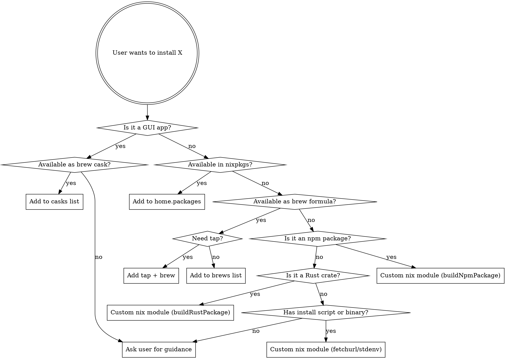

# Installing Packages

Install tools and apps into this nix-darwin/home-manager system config.

## Trigger

User says "install this", drops a link, or asks to add a tool/package/app.

## CRITICAL: No Direct Package Manager Installs

**NEVER run any of these commands:**
- `npm install -g` — nix store is read-only, and global npm installs bypass declarative config
- `pip install` / `pipx install`
- `cargo install`
- `go install`
- Any other language-level global install command

All packages MUST be installed through this system config (nix, homebrew, or custom nix module). Direct installs are ephemeral, non-reproducible, and will fail on nix-managed systems.

## Decision Tree



## Priority Order

1. **Nix package** (nixpkgs) — preferred for CLI tools
2. **Homebrew cask** — preferred for GUI/macOS apps
3. **Homebrew formula** — when nixpkgs is broken, outdated, or unavailable
4. **Custom nix module** — for local projects, crates, or custom builds
5. **Ask user** — when none of the above work

## Research Steps

When the user drops a link:

1. **Read the link** — identify what the tool is, what it does, how it's distributed
2. **Search nixpkgs** — `nix search nixpkgs <name>` (use ctx_execute)
3. **Search brew** — `brew search <name>` (use ctx_execute)
4. **Check for cask** — `brew info --cask <name>` if it's a GUI app
5. **Check GitHub releases** — look for pre-built binaries, Cargo.toml, etc.
6. **Present the options** to the user with a recommendation

## File Locations

| Method | File | Section |
|--------|------|---------|
| Nix package | `modules/home-manager/packages/default.nix` | `home.packages` list (alphabetical) |
| Nix (macOS-only) | `modules/home-manager/packages/darwin.nix` | `home.packages` list |
| Nix (Linux-only) | `modules/home-manager/packages/linux.nix` | `home.packages` list |
| Brew formula | `modules/darwin/homebrew/default.nix` | `brews` list |
| Brew cask | `modules/darwin/homebrew/default.nix` | `casks` list |
| Brew tap | `modules/darwin/homebrew/default.nix` | `taps` list |
| Custom module | `modules/home-manager/packages/<name>.nix` | New file + wire into default.nix |

## Adding a Nix Package

Add the package name alphabetically to `home.packages` in `modules/home-manager/packages/default.nix`:

```nix
home.packages = with pkgs; [
  # ... alphabetical ...
  new-package
  # ...
];
```

## Adding a Brew Formula or Cask

Edit `modules/darwin/homebrew/default.nix`. Add to the appropriate list (alphabetical):

```nix
# Formula (CLI tool)
brews = [
  "new-tool"
];

# Cask (GUI app)
casks = [
  "new-app"
];

# If a custom tap is needed, add it first:
taps = [
  "org/tap-name"
];
```

## Creating a Custom Nix Module

For tools not in nixpkgs or homebrew. Three patterns:

### npm package (from npm registry)

Create `modules/home-manager/packages/<name>.nix`:

```nix
{pkgs, ...}:
pkgs.buildNpmPackage rec {
  pname = "<name>";
  version = "<version>";

  src = pkgs.fetchurl {
    url = "https://registry.npmjs.org/${pname}/-/${pname}-${version}.tgz";
    hash = "";  # nix will tell you the correct hash on first build
  };

  sourceRoot = ".";

  # Use prefetch-npm-deps to compute this hash from package-lock.json
  # If not available: nix-build '<nixpkgs>' -A prefetch-npm-deps --no-out-link
  npmDepsHash = "";

  # Fetch package-lock.json if not included in the tarball
  postUnpack = ''
    cp ${pkgs.fetchurl {
      url = "https://raw.githubusercontent.com/<owner>/<repo>/main/package-lock.json";
      hash = "";
    }} package-lock.json || true
  '';

  dontNpmBuild = true;  # set to false if the package needs a build step

  meta = with pkgs.lib; {
    description = "<description>";
    homepage = "<url>";
    license = licenses.mit;
    mainProgram = "<binary-name>";
  };
}
```

### Rust crate (from crates.io)

Create `modules/home-manager/packages/<name>.nix`:

```nix
{pkgs, ...}:
pkgs.rustPlatform.buildRustPackage rec {
  pname = "<name>";
  version = "<version>";

  src = pkgs.fetchCrate {
    inherit pname version;
    hash = "";  # nix will tell you the correct hash on first build
  };

  cargoHash = "";  # nix will tell you the correct hash on first build

  doCheck = false;  # if tests need network

  meta = with pkgs.lib; {
    description = "<description>";
    homepage = "<url>";
    license = licenses.mit;
    mainProgram = "<binary-name>";
  };
}
```

### Local project (Rust)

Create `modules/home-manager/packages/<name>.nix`:

```nix
{pkgs, ...}:
let
  srcPath = /Users/john.allen/dev/src/<project>;
in
pkgs.rustPlatform.buildRustPackage {
  pname = "<name>";
  version = "0.1.0";

  src = pkgs.lib.cleanSourceWith {
    src = srcPath;
    filter = path: type:
      let baseName = baseNameOf path;
      in !(baseName == ".beads" || baseName == ".git" || baseName == "target");
  };

  cargoLock = {
    lockFile = /Users/john.allen/dev/src/<project>/Cargo.lock;
  };

  meta = with pkgs.lib; {
    description = "<description>";
    license = licenses.mit;
    mainProgram = "<binary-name>";
  };
}
```

### Wire into default.nix

After creating the module file, add to `modules/home-manager/packages/default.nix`:

```nix
# At the top, with other custom imports:
  new-tool = import ./new-tool.nix {inherit pkgs;};

# At the bottom, in the home.packages list:
    ++ [ai-intercept mpv-queue nail-parquet new-tool];
```

## After Installation

Run `nix-rebuild --switch-only` (fish shell) or `sudo darwin-rebuild switch --impure --flake ~/dev/src/system-config/` (bash) to apply changes.

## Common Pitfalls

- **Hash mismatches**: Leave hash fields empty (`""`) on first build — nix error output gives you the correct hash
- **Alphabetical order**: Keep all lists sorted alphabetically
- **Broken in nixpkgs**: Some packages break periodically — add a comment and fall back to brew (e.g., `# llm # broken in nixpkgs jan 2025`)
- **Outdated in nixpkgs**: If the nix version lags significantly, brew may be preferable — add a comment explaining why
